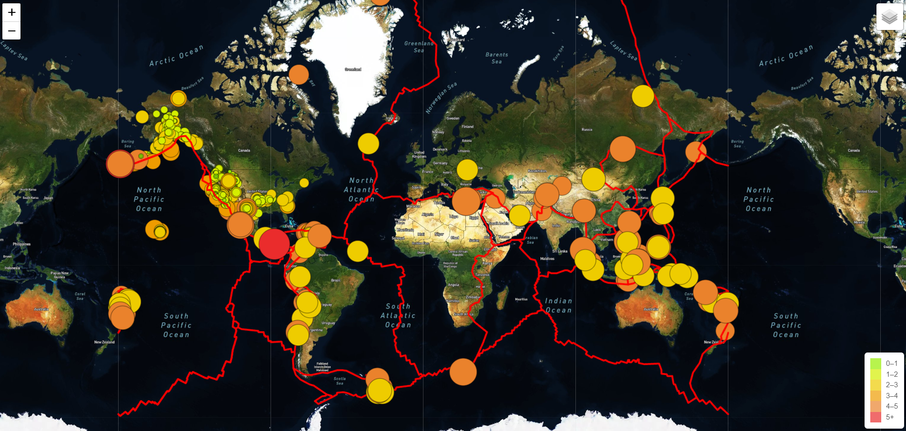

# Mapping_Earthquakes.

Creating interactive maps using GeoJSON data, JavaScript, D3.js library and Leaflet library. 

## Objective

The purpose of this project is to visually show the differences between the magnitudes of earthquakes all over the world for the last seven days.

For further information here is a link to the webpage to see the full functionality of interactive maps [github page](https://enricoroblesdelrio.github.io/Mapping_Earthquakes/)

Satellite view:

